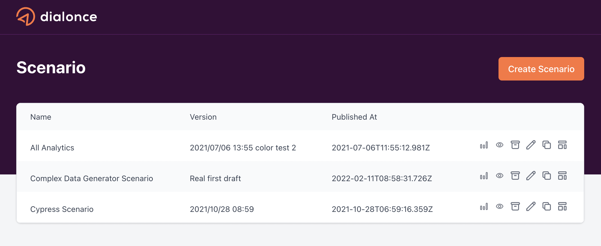

# Dial-Once - Simple test

## How to use

```sh
npm install
npm run dev
```

## Exercise

The aim is to reproduce this page in multiple steps:


- [ ] Create a Logo component using `logo.svg` in `public` folder.
- [ ] Update MUI theme for adding re-usable colors.
- [ ] Fetch `GET /api/scenarios` to get all available scenario.
- [ ] Create a table that display the scenarios name, their version and their publication date.
- [ ] Add the 6 little action buttons that displays the scenario's id in the console.
- [ ] Add a rounded orange button 'Create scenario'.
- [ ] Use `dayjs` to display formatted dates using the french format (21/01/2022 13:44) for the publication date.
- [ ] Add Jest to test your `dayjs` formating function.
